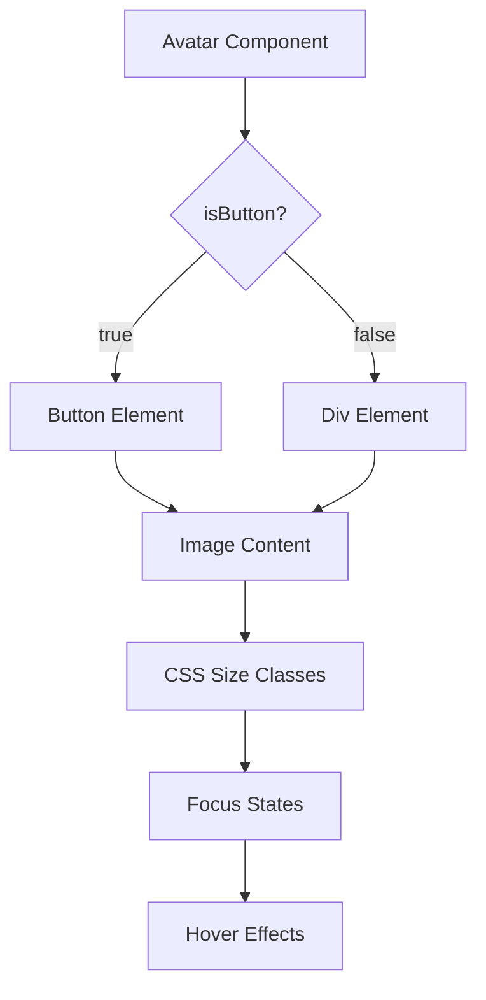

# Avatar Component Implementation Plan

## Overview
Create a new reusable `Avatar.svelte` component that extracts the avatar functionality from `ChatTrigger.svelte` into a flexible, accessible primitive component.

## Component API Design

### Props Interface
```typescript
interface AvatarProps {
  // Core functionality
  isButton?: boolean;           // Default: false
  size?: 'sm' | 'md' | 'lg';   // Default: 'md'
  content?: string;             // Image URL/path, defaults to FacelessPic.png
  
  // Button-specific props (only when isButton=true)
  handleClick?: () => void;
  disabled?: boolean;
  
  // Accessibility
  alt?: string;                 // Alt text for image or aria-label for button
  
  // Styling
  class?: string;               // Additional CSS classes
}
```

### Size System
Based on the existing design system in `app.css`, create three size variants:

```css
/* Size variants with consistent aspect ratio (4:5 from original) */
.avatar-sm {
  width: clamp(40px, 15vw, 120px);
  aspect-ratio: 4 / 5;
}

.avatar-md {
  width: clamp(60px, 20vw, 180px);  /* Current ChatTrigger size */
  aspect-ratio: 4 / 5;
}

.avatar-lg {
  width: clamp(80px, 25vw, 240px);
  aspect-ratio: 4 / 5;
}
```

## Component Structure

### File Organization
```
[`frontend/src/lib/components/primatives/`](../../../frontend/src/lib/components/primatives/)
├── Avatar.svelte          # New component
├── Icon.svelte           # Existing
├── Tag.svelte            # Existing
└── index.js              # Update to export Avatar
```

### Component Architecture



## Implementation Plan

### 1. TypeScript Interface
Following the project's pattern from `Button.svelte`, create a discriminated union:

```typescript
type BaseAvatarProps = {
  size?: 'sm' | 'md' | 'lg';
  content?: string;
  alt?: string;
  class?: string;
};

type AvatarProps = BaseAvatarProps & (
  | {
      isButton: true;
      handleClick: () => void;
      disabled?: boolean;
    }
  | {
      isButton?: false;
      handleClick?: never;
      disabled?: never;
    }
);
```

### 2. Accessibility Features
- **Focus Management**: Use CSS custom properties from `app.css`
  ```css
  :focus-visible {
    outline: var(--focus-ring-width) solid var(--focus-ring-color);
    outline-offset: var(--focus-ring-offset);
  }
  ```
- **ARIA Labels**: Proper `aria-label` for buttons, `alt` for images
- **Keyboard Navigation**: Native button behavior when `isButton=true`
- **Screen Reader Support**: Semantic HTML elements

### 3. Styling System
Leverage existing CSS custom properties:

```css
.avatar {
  position: relative;
  display: flex;
  align-items: center;
  justify-content: center;
  background-color: rgba(var(--bg-page) / 0);
  border: none;
  border-radius: var(--bdr-radius-small);
  padding: 4px;
  box-shadow: inset 0 0 0 1px rgba(var(--fg-text-primary) / 1);
  container-type: inline-size;
  transition: var(--transition-fast);
}

.avatar-image {
  display: flex;
  width: 100%;
  height: 100%;
  background-size: cover;
  background-position: top;
  background-repeat: no-repeat;
  border-radius: var(--bdr-radius-tiny);
  transition: var(--transition-fast);
}

/* Button-specific styles */
.avatar-button {
  cursor: pointer;
}

.avatar-button:hover .avatar-image {
  transform: scale(0.98);
}

.avatar-button:disabled {
  opacity: 0.5;
  cursor: not-allowed;
}
```

### 4. Component Implementation

```svelte
<script lang="ts">
  import FacelessPic from '$lib/assets/FacelessPic.png';
  
  // Props with discriminated union
  let props: AvatarProps = $props();
  
  const {
    size = 'md',
    content = FacelessPic,
    alt = 'Avatar',
    class: className = '',
    isButton = false
  } = props;
  
  // Compute classes
  const classes = $derived([
    'avatar',
    `avatar-${size}`,
    isButton && 'avatar-button',
    className
  ].filter(Boolean).join(' '));
  
  // Handle click for button variant
  function handleClick() {
    if (isButton && props.handleClick && !props.disabled) {
      props.handleClick();
    }
  }
</script>

{#if isButton}
  <button
    class={classes}
    onclick={handleClick}
    disabled={props.disabled}
    aria-label={alt}
  >
    <span 
      class="avatar-image" 
      style="background-image: url({content})"
      role="img"
      aria-label={alt}
    ></span>
  </button>
{:else}
  <div class={classes}>
    <span 
      class="avatar-image" 
      style="background-image: url({content})"
      role="img"
      aria-label={alt}
    ></span>
  </div>
{/if}
```

## Usage Examples

### Basic Avatar
```svelte
<Avatar 
  content="/path/to/image.jpg" 
  alt="User profile picture" 
/>
```

### Button Avatar (like current ChatTrigger)
```svelte
<Avatar 
  isButton={true}
  size="md"
  handleClick={() => console.log('Avatar clicked')}
  alt="Chat with Peter Abbott"
/>
```

### Different Sizes
```svelte
<Avatar size="sm" />
<Avatar size="md" />
<Avatar size="lg" />
```

## Migration Strategy

1. **Create the new Avatar component** in [`frontend/src/lib/components/primatives/Avatar.svelte`](../../../frontend/src/lib/components/primatives/Avatar.svelte)
2. **Update the primitives index** to export the new component
3. **Test the component** in isolation with different props
4. **Later**: Refactor `ChatTrigger.svelte` to use the new Avatar component (separate task)

## Benefits

1. **Reusability**: Can be used throughout the application for user avatars, profile pictures, etc.
2. **Consistency**: Follows established design system patterns
3. **Accessibility**: Built-in focus management and ARIA support
4. **Flexibility**: Easy to extend with new content types in the future
5. **Type Safety**: Proper TypeScript discrimination prevents invalid prop combinations
6. **Performance**: Leverages CSS custom properties and efficient styling

## Future Extensibility

The component is designed to easily accommodate future content types:
- **Icons**: Could add `IconName` from the existing icon system
- **Initials**: Text-based avatars with user initials
- **Status indicators**: Online/offline badges
- **Custom content**: Slot-based content for complex scenarios

## Implementation Steps

1. Create `Avatar.svelte` component file
2. Implement TypeScript interfaces
3. Add CSS styling with size variants
4. Implement accessibility features
5. Update primitives index to export Avatar
6. Create test page to verify functionality
7. Document usage patterns

## Technical Requirements

- **Svelte 5**: Use `$props()` and `$derived` syntax
- **TypeScript**: Proper type safety with discriminated unions
- **CSS Custom Properties**: Leverage existing design system
- **Accessibility**: WCAG 2.1 AA compliance
- **Responsive**: Container queries and clamp-based sizing
- **Performance**: Efficient rendering and minimal DOM updates
## Related Components & Routes
- [`../frontend/src/lib/components/primatives/Avatar.svelte`](../../../frontend/src/lib/components/primatives/Avatar.svelte)
- `../frontend/src/routes/test-avatar/+page.svelte`
- `../frontend/src/routes/test-avatar-enhanced/+page.svelte`
