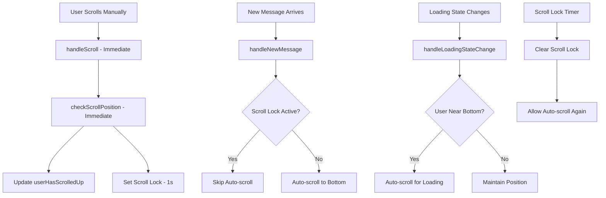

# ChatMessages Auto-Scroll Refactoring Plan

## Problem Statement

The current auto-scroll functionality in [`ChatMessages.svelte`](../../../frontend/src/lib/components/chat/ChatMessages.svelte) is causing issues where users cannot scroll up to read older messages because the auto-scroll immediately pulls them back to the bottom.

### Current Issues
- **Immediate scroll interference**: Users cannot scroll up at all - they get pulled back to bottom immediately
- **Timing conflicts**: The reactive statement triggers before scroll position is properly detected
- **Poor user experience**: Reading older messages is impossible due to aggressive auto-scroll behavior

### Desired Behavior
- ✅ Allow users to scroll up and read older messages without interference
- ✅ Auto-scroll to bottom when new messages arrive (if user is at/near bottom)
- ✅ Auto-scroll users back to bottom when new messages arrive (even if scrolled up)

## Root Cause Analysis

### Current Implementation Problems

1. **Reactive Statement Timing Issue** (Line 43)
   ```typescript
   $: if (messagesContainer && (messages.length || isLoading)) {
       if (!userHasScrolledUp) {
           setTimeout(() => { /* scroll logic */ }, 50);
       }
   }
   ```
   - Triggers immediately on any `messages.length` or `isLoading` change
   - Runs before `userHasScrolledUp` can be properly updated

2. **Delayed Scroll Position Detection** (Lines 37-39)
   ```typescript
   scrollTimeout = setTimeout(() => {
       checkScrollPosition();
   }, 100);
   ```
   - 100ms delay creates race condition with reactive statement
   - User scroll intent not detected fast enough

3. **Imprecise Scroll Detection**
   - Only checks distance from bottom, not scroll direction or user intent
   - No protection against rapid successive scroll events

## Refactoring Architecture

### 1. Immediate Scroll Position Tracking

**Replace delayed detection with immediate tracking:**

```typescript
// Remove setTimeout delays
function handleScroll() {
    if (!messagesContainer) return;
    
    // Immediate position check
    checkScrollPosition();
    
    // Set scroll lock to prevent auto-scroll interference
    setScrollLock();
}
```

### 2. Message-Based Change Detection

**Track actual message changes instead of array length:**

```typescript
let previousMessageCount = 0;
let lastMessageId = '';

// Detect new messages specifically
$: if (messages.length > previousMessageCount) {
    const newMessage = messages[messages.length - 1];
    if (newMessage?.id !== lastMessageId) {
        handleNewMessage(newMessage);
        lastMessageId = newMessage.id;
        previousMessageCount = messages.length;
    }
}
```

### 3. Scroll Lock Mechanism

**Prevent auto-scroll interference during manual scrolling:**

```typescript
let scrollLockActive = false;
let scrollLockTimeout: ReturnType<typeof setTimeout>;

function setScrollLock() {
    scrollLockActive = true;
    clearTimeout(scrollLockTimeout);
    
    scrollLockTimeout = setTimeout(() => {
        scrollLockActive = false;
    }, 1000); // 1 second protection
}
```

### 4. Enhanced User Intent Detection

**Track scroll direction and velocity:**

```typescript
let lastScrollTop = 0;
let scrollDirection: 'up' | 'down' | 'none' = 'none';
let userActivelyScrolling = false;

function checkScrollPosition() {
    if (!messagesContainer) return;
    
    const { scrollTop, scrollHeight, clientHeight } = messagesContainer;
    
    // Detect scroll direction
    scrollDirection = scrollTop > lastScrollTop ? 'down' : 
                     scrollTop < lastScrollTop ? 'up' : 'none';
    
    // Update user scroll state
    const distanceFromBottom = scrollHeight - scrollTop - clientHeight;
    const threshold = 100;
    
    userHasScrolledUp = distanceFromBottom > threshold;
    userActivelyScrolling = scrollDirection !== 'none';
    
    lastScrollTop = scrollTop;
}
```

### 5. Smart Auto-Scroll Logic

**Controlled auto-scroll with user intent awareness:**

```typescript
function handleNewMessage(message: ChatMessage) {
    if (!messagesContainer || scrollLockActive) return;
    
    // Always scroll for new messages (as per user requirement)
    requestAnimationFrame(() => {
        if (messagesContainer) {
            messagesContainer.scrollTop = messagesContainer.scrollHeight;
        }
    });
}

function handleLoadingStateChange() {
    if (!messagesContainer || scrollLockActive) return;
    
    // Only auto-scroll for loading if user is near bottom
    if (!userHasScrolledUp) {
        requestAnimationFrame(() => {
            if (messagesContainer) {
                messagesContainer.scrollTop = messagesContainer.scrollHeight;
            }
        });
    }
}
```

## Implementation Flow Diagram



## Detailed Implementation Steps

### Step 1: Remove Timing Issues
- [ ] Remove `setTimeout` from `handleScroll()`
- [ ] Make `checkScrollPosition()` immediate
- [ ] Use `requestAnimationFrame` for smooth scrolling

### Step 2: Implement Scroll Lock
- [ ] Add `scrollLockActive` state variable
- [ ] Create `setScrollLock()` function with 1-second timer
- [ ] Integrate scroll lock checks in auto-scroll logic

### Step 3: Enhanced Scroll Detection
- [ ] Add scroll direction tracking
- [ ] Implement velocity-based user intent detection
- [ ] Improve "near bottom" threshold logic

### Step 4: Message-Based Reactivity
- [ ] Replace array length reactive statement
- [ ] Track individual message additions by ID
- [ ] Separate new message handling from loading state

### Step 5: Smart Auto-Scroll Functions
- [ ] Create `handleNewMessage()` for new message auto-scroll
- [ ] Create `handleLoadingStateChange()` for loading state
- [ ] Use `requestAnimationFrame` for smooth animations

### Step 6: UI Enhancements (Optional)
- [ ] Add "Scroll to Bottom" button when scrolled up
- [ ] Add subtle new message indicator
- [ ] Implement smooth scroll animations

## Code Structure Changes

### New State Variables
```typescript
let scrollLockActive = false;
let scrollLockTimeout: ReturnType<typeof setTimeout>;
let lastScrollTop = 0;
let scrollDirection: 'up' | 'down' | 'none' = 'none';
let previousMessageCount = 0;
let lastMessageId = '';
```

### New Functions
```typescript
function setScrollLock(): void
function handleNewMessage(message: ChatMessage): void
function handleLoadingStateChange(): void
function smoothScrollToBottom(): void
```

### Modified Functions
```typescript
function handleScroll(): void // Remove setTimeout
function checkScrollPosition(): void // Add direction tracking
```

## Testing Strategy

### Manual Testing Scenarios
1. **Scroll Up Test**: Verify user can scroll up without being pulled back
2. **New Message Test**: Confirm auto-scroll works when new messages arrive
3. **Loading State Test**: Check loading indicator scroll behavior
4. **Rapid Scroll Test**: Test scroll lock prevents interference
5. **Edge Cases**: Test with very long messages, rapid message arrival

### Expected Behavior After Implementation
- ✅ **Manual scrolling works immediately** - no fighting with auto-scroll
- ✅ **Auto-scroll works for new messages** - always returns user to bottom
- ✅ **Reading older messages is smooth** - no interruptions during scroll lock
- ✅ **Loading states handled properly** - scroll to show typing indicator when appropriate
- ✅ **Responsive and smooth** - uses `requestAnimationFrame` for performance

## Performance Considerations

- **Debouncing**: Scroll lock prevents excessive auto-scroll calls
- **RAF Usage**: `requestAnimationFrame` ensures smooth animations
- **Memory Management**: Proper cleanup of timeouts and event listeners
- **Minimal Re-renders**: Targeted state updates to prevent unnecessary renders

## Backward Compatibility

- All existing props and events remain unchanged
- Component API stays the same
- Only internal scroll behavior logic is modified
- No breaking changes to parent components

## Success Criteria

1. ✅ User can scroll up to read older messages without interference
2. ✅ Auto-scroll activates when new messages arrive
3. ✅ Smooth, responsive scrolling experience
4. ✅ No timing conflicts or race conditions
5. ✅ Maintains existing component API
6. ✅ Performance improvements with RAF and debouncing

---

**Next Steps**: Implement this refactoring plan in the [`ChatMessages.svelte`](../../../frontend/src/lib/components/chat/ChatMessages.svelte) component following the detailed steps outlined above.
## Related Component
- [`../frontend/src/lib/components/chat/ChatMessages.svelte`](../../../frontend/src/lib/components/chat/ChatMessages.svelte)
