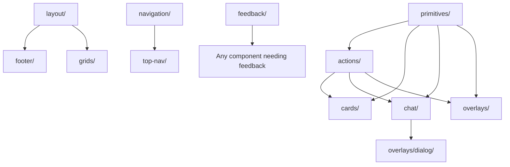

# Component Structure Analysis

## Directory Structure

```
frontend/src/lib/components/
├── ComponentRules.md                    # Documentation
├── TestThemeHook.svelte                 # Testing utility
├── __tests__/                           # Test directory
│   └── ThemeIntegration.spec.ts
├── accordion/                           # Collapsible content
│   ├── Accordion.svelte
│   ├── AccordionList.svelte
│   ├── accordionItems/                  # Nested items (deprecated?)
│   ├── index.ts                         # Barrel export
│   └── items/                           # Content items
│       ├── Experience.svelte
│       ├── Introduction.svelte
│       ├── Process.svelte
│       └── index.ts
├── actions/                             # Interactive elements
│   ├── Button.svelte
│   ├── GemButton.svelte
│   ├── IconButton.svelte
│   ├── PromptButton.svelte
│   └── index.ts
├── cards/                               # Content cards
│   ├── ImageCard.svelte
│   ├── TextCard.svelte
│   ├── VideoCard.svelte
│   └── index.ts
├── chat/                                # Chat interface
│   ├── ChatDialog.svelte
│   ├── ChatInput.svelte
│   ├── ChatMessage.svelte
│   ├── ChatMessages.svelte
│   ├── QAChat.svelte
│   └── index.ts
├── experimental/                        # Experimental components
│   └── dialog/
│       ├── TestOne.svelte
│       ├── TestThree.svelte
│       └── TestTwo.svelte
├── feedback/                            # User feedback elements
│   ├── Callout.svelte
│   ├── ProgressIndicator.svelte
│   ├── ProgressToast.svelte
│   └── index.ts
├── filters/                             # Filter controls
│   ├── FilterGroup.svelte
│   ├── FilterToggle.svelte
│   └── index.ts
├── footer/                              # Footer-related (empty)
│   └── index.ts
├── forms/                               # Form components (empty)
├── graphics/                            # Animation/graphics
│   ├── AnimatedTextPath.svelte
│   ├── AnimatedTextPathSpag.svelte
│   ├── CanvasAnimation.svelte
│   └── index.ts
├── grids/                               # Layout grids
│   ├── GridLayout.svelte
│   └── index.ts
├── layout/                              # Layout components
│   ├── BasicLayout.svelte
│   ├── Grid.svelte
│   ├── GridItem.svelte
│   ├── footer/
│   │   ├── Footer.svelte
│   │   ├── FooterTitle.svelte
│   │   └── index.ts
│   └── index.ts
├── marginalia/                          # Decorative elements
│   ├── RainDrops.svelte
│   └── index.ts
├── media/                               # Media components
│   ├── VideoTile.svelte
│   └── index.ts
├── navigation/                          # Navigation elements
│   ├── Link.svelte
│   ├── LinkList.svelte
│   └── index.ts
├── overlays/                            # Modal/overlay components
│   └── dialog/
│       ├── [15 dialog components]
│       └── index.ts
├── primitives/                          # Base primitive components
│   ├── Avatar.svelte
│   ├── Icon.svelte
│   ├── IconRefresh.svelte
│   ├── Indicator.svelte
│   ├── List.svelte
│   ├── McpText.svelte
│   ├── Subheader.svelte
│   ├── Tag.svelte
│   ├── TagList.svelte
│   └── index.ts
├── snoop/                               # Weather-related (untracked)
│   ├── Weather.svelte
│   ├── WeatherDebugPanel.svelte
│   ├── WeatherIcon.svelte
│   └── index.ts
└── top-nav/                             # Top navigation
    ├── ChatTrigger.svelte
    ├── TopNav.svelte
    └── index.ts
```

## Component Naming Conventions

### File Naming
- **PascalCase** for component files: `Button.svelte`, `ChatDialog.svelte`
- **kebab-case** for directories: `top-nav/`, `chat/`
- **camelCase** for nested directories: `accordionItems/`

### Component Naming
- Components use descriptive, noun-based names
- Variants indicated by prefixes: `IconButton`, `GemButton`, `PromptButton`
- Context-specific naming: `ChatInput`, `ChatMessage`, `ChatDialog`

## Import/Export Conventions

### Barrel Exports
Each directory contains an `index.ts` file for barrel exports:

```typescript
// actions/index.ts
export { default as Button } from './Button.svelte';
export { default as IconButton } from './IconButton.svelte';
export { default as GemButton } from './GemButton.svelte';
export { default as PromptButton } from './PromptButton.svelte';
```

### Import Patterns
- **Barrel imports** (preferred): `import { Button } from '$lib/components/actions';`
- **Direct imports** (legacy): `import Button from '$lib/components/actions/Button.svelte';`
- **Primitive imports**: `import { Tag } from '../primitives';`

### Cross-Component Relationships



## Component Categories

### 1. Primitives (Base Layer)
- `Avatar`, `Icon`, `Tag`, `List`
- No dependencies on other components
- Used throughout the system

### 2. Actions (Interactive Layer)
- `Button`, `IconButton`, `GemButton`, `PromptButton`
- Depends on primitives for icons/tags
- Reused in cards, dialogs, navigation

### 3. Composition (Complex Layer)
- `cards/`, `chat/`, `overlays/`
- Combines primitives and actions
- Domain-specific functionality

### 4. Layout (Structural Layer)
- `layout/`, `grids/`, `navigation/`
- Page-level organization
- Uses actions and primitives

### 5. Specialized (Feature Layer)
- `graphics/`, `marginalia/`, `media/`
- Specific use cases
- Minimal dependencies

## Critique: Design System Scalability

### Strengths

1. **Clear Hierarchy**: Primitive → Action → Composition pattern is well-established
2. **Barrel Exports**: Consistent use of index.ts files for clean imports
3. **Functional Grouping**: Components are logically grouped by purpose
4. **Component Isolation**: Each component is self-contained with its own directory

### Critical Issues

1. **Inconsistent Directory Naming**
   - Mix of kebab-case (`top-nav`) and camelCase (`accordionItems`)
   - Creates confusion and maintenance overhead

2. **Structural Inconsistencies**
   - `footer/` directory with only index.ts but actual footer in `layout/footer/`
   - Empty `forms/` directory suggests incomplete organization
   - `experimental/` components lack barrel exports

3. **Dependency Management**
   - No clear dependency injection pattern
   - Components tightly coupled to specific primitives
   - Hard to substitute or theme components

4. **Scalability Concerns**
   - `overlays/dialog/` contains 15+ components in one directory
   - No theming or variant system for systematic styling
   - Missing composition patterns for complex UIs

5. **Missing Design System Fundamentals**
   - No token system for consistent spacing/colors
   - No systematic approach to responsive design
   - No documented component API contracts

### Recommendations for Scalability

1. **Standardize Naming**: Use consistent kebab-case for all directories
2. **Implement Token System**: Create design tokens for spacing, colors, typography
3. **Add Composition Patterns**: Compound components, render props, slots
4. **Improve Documentation**: Component APIs, usage examples, design guidelines
5. **Add Theming Layer**: Systematic approach to variants and themes
6. **Reduce Directory Nesting**: Flatten deep hierarchies for better discoverability
7. **Add Type Safety**: Strong TypeScript interfaces for all props and events

### Priority Fixes

1. **High**: Standardize directory naming conventions
2. **High**: Implement design token system
3. **Medium**: Consolidate footer structure
4. **Medium**: Add barrel exports to experimental components
5. **Low**: Document component APIs and relationships