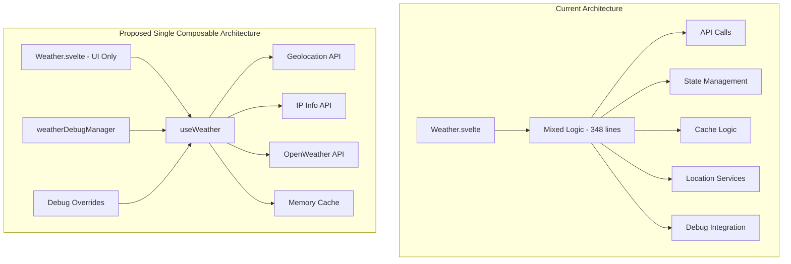

# Weather API Separation Plan: Single Composable Approach

## Overview
Separate API logic from the [`Weather.svelte`](../../frontend/src/lib/components/Snoop/Weather.svelte) component using a single `useWeather` composable while maintaining full backwards compatibility.

## Architecture: Single Composable Pattern



## Single Composable Design

### `useWeather` - All Weather Logic
**Location**: `frontend/src/lib/composables/useWeather.ts`

```typescript
export function useWeather() {
  // All current logic from Weather.svelte:
  // - Location services (geolocation + IP fallback)
  // - Weather API calls
  // - Caching logic
  // - State management
  // - Error handling
  // - Debug integration
  // - Retry logic
}
```

## Implementation Strategy

### Phase 1: Extract Types and Constants
1. Create `frontend/src/lib/types/weather.ts` with extracted types from component
2. Update `frontend/src/lib/types/index.ts` to reference existing types only
3. Extract constants to shared configuration

### Phase 2: Create Single Composable
1. **`useWeather`**: Extract ALL logic from Weather.svelte into one composable
2. Maintain exact same state management and behavior
3. Preserve all debug integration

### Phase 3: Refactor Component
1. Replace inline logic with single composable call
2. Maintain exact same component interface
3. Preserve all existing behavior and debug integration

### Phase 4: Future Expansion (Optional)
1. Can later split into multiple composables if needed
2. Current approach provides immediate separation
3. Easier to test and maintain

## File Structure

```
frontend/src/lib/
├── composables/
│   ├── useCache.ts
│   ├── useLocation.ts
│   ├── useWeather.ts
│   └── index.ts
├── types/
│   ├── weather.ts (extracted from component)
│   ├── weatherDebug.ts (existing)
│   ├── icons.ts (existing)
│   └── index.ts (updated)
├── config/
│   └── weather.ts (constants and config)
└── components/Snoop/
    └── Weather.svelte (refactored to use composables)
```

## Backwards Compatibility Guarantees

### Component Interface
- ✅ Same props: `{ class?: string }`
- ✅ Same events and behaviors
- ✅ Same loading states and error handling
- ✅ Same cache behavior and timing

### Debug System Integration
- ✅ Full integration with existing [`weatherDebugManager.svelte.ts`](frontend/src/lib/stores/weatherDebugManager.svelte.ts)
- ✅ All debug overrides work identically
- ✅ Mock data injection preserved
- ✅ Debug panel functionality maintained

### State Management
- ✅ Identical loading states: `IDLE`, `GETTING_LOCATION`, `FETCHING_WEATHER`
- ✅ Same error types: `LOCATION_DENIED`, `API_ERROR`, `NETWORK_ERROR`, `NO_LOCATION`
- ✅ Identical retry logic and timeout handling
- ✅ Same cache validation and expiration

## Benefits of Composable Pattern

### 1. **Reusability**
```typescript
// Can be used in other components
const weather = useWeather();
const location = useLocation();
```

### 2. **Testability**
```typescript
// Easy to unit test
import { useWeather } from '$lib/composables';
// Test composable logic independently
```

### 3. **Separation of Concerns**
- **`useCache`**: Pure caching logic
- **`useLocation`**: Location services only
- **`useWeather`**: Weather API and orchestration
- **Component**: UI rendering only

### 4. **Debug Integration**
```typescript
// Debug overrides work seamlessly
const weather = useWeather();
// weatherDebugManager automatically integrates
```

### 5. **Type Safety**
```typescript
// Full TypeScript support
const { data, loading, error, retry } = useWeather();
// data: WeatherData | null
// loading: LoadingStateType
// error: WeatherErrorTypeType | null
```

## Migration Path

### Before (Current)
```svelte
<!-- Weather.svelte - 348 lines of mixed logic -->
<script lang="ts">
  // All API logic, state management, caching inline
  async function fetchWeatherData() { /* 55 lines */ }
  async function fetchIPLocation() { /* 12 lines */ }
  function handleGeolocationSuccess() { /* 7 lines */ }
  // ... 300+ more lines
</script>
```

### After (Composables)
```svelte
<!-- Weather.svelte - ~50 lines of UI logic -->
<script lang="ts">
  import { useWeather } from '$lib/composables';
  
  let { class: className = '' } = $props();
  
  const { data, loading, error, retry, requestLocation } = useWeather();
</script>
```

## Implementation Details

### Composable Communication
```typescript
// useWeather orchestrates other composables
export function useWeather() {
  const location = useLocation();
  const cache = useCache({ duration: 10 * 60 * 1000 });
  
  // Reactive integration
  $effect(() => {
    if (location.data) {
      fetchWeatherForLocation(location.data);
    }
  });
}
```

### Debug Integration
```typescript
// Each composable integrates with debug manager
export function useLocation() {
  const debug = weatherDebugManager;
  
  $effect(() => {
    if (debug.isOverrideMode && debug.currentMockLocation) {
      // Apply debug overrides
    }
  });
}
```

## Next Steps

1. **Create type definitions** - Extract types from component
2. **Implement `useCache`** - Start with simplest composable
3. **Implement `useLocation`** - Location services with debug support
4. **Implement `useWeather`** - Main orchestrating composable
5. **Refactor component** - Replace inline logic with composable calls
6. **Test integration** - Ensure debug system works perfectly

This approach provides clean separation while maintaining the exact same functionality and debug capabilities you currently have.
## Related Components
- [`../frontend/src/lib/components/Snoop/Weather.svelte`](../../frontend/src/lib/components/Snoop/Weather.svelte)
- [`../frontend/src/lib/components/Snoop/WeatherIcon.svelte`](../../frontend/src/lib/components/Snoop/WeatherIcon.svelte)
