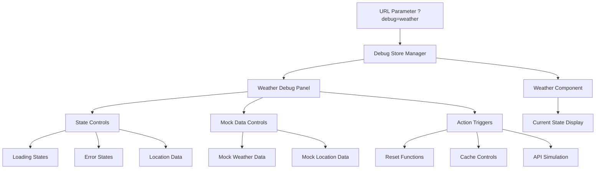

# Weather Component Debug Interface Plan

## Overview

Create a comprehensive debug interface that allows testing all states of the `Weather.svelte` component, activated via URL parameter `?debug=weather`.

## Requirements

- **Component**: `frontend/src/lib/components/Snoop/Weather.svelte`
- **Activation**: URL parameter `?debug=weather`
- **Capabilities**: Manually set different loading states, error states, and mock weather data
- **Scope**: Testing all visual states of the Weather component

## Architecture



## Current Weather Component Analysis

### State Structure

- **weatherState**: `{ data: WeatherData | null, loading: LoadingStateType, error: WeatherErrorTypeType | null }`
- **locationData**: `{ geoLocation: GeoLocation | null, ipInfo: IPInfo | null }`
- **weatherCache**: `{ data: WeatherData | null, timestamp: number }`
- **initialized**: `boolean`
- **retryTimeout**: `number`

### Loading States

- `IDLE`: 'idle'
- `GETTING_LOCATION`: 'getting_location'
- `FETCHING_WEATHER`: 'fetching_weather'

### Error Types

- `LOCATION_DENIED`: 'location_denied'
- `API_ERROR`: 'api_error'
- `NETWORK_ERROR`: 'network_error'
- `NO_LOCATION`: 'no_location'

### Current Usage

- Used in `Footer.svelte` and `OverlayMenu.svelte`
- Integrates with OpenWeatherMap API
- Uses geolocation and IP-based fallback

## Implementation Plan

### 1. Debug Store Creation

**File**: `frontend/src/lib/stores/weatherDebugManager.svelte.ts`

**Purpose**: Centralized state management for debug functionality

**Features**:

- URL parameter detection (`?debug=weather`)
- Debug state management using Svelte 5 runes
- Mock data injection capabilities
- State override functions
- Development-only activation

**Key Functions**:

```typescript
- isDebugActive(): boolean
- setLoadingState(state: LoadingStateType): void
- setErrorState(error: WeatherErrorTypeType): void
- injectMockWeatherData(data: WeatherData): void
- injectMockLocationData(location: GeoLocation | IPInfo): void
- resetComponentState(): void
- clearCache(): void
- triggerRetry(): void
```

### 2. Weather Component Modification

**File**: `frontend/src/lib/components/Snoop/Weather.svelte`

**Changes**:

- Import debug store
- Add debug mode detection
- Implement state override logic when debug is active
- Add debug panel integration
- Maintain backward compatibility (zero impact when debug disabled)

**Integration Points**:

- State initialization with debug overrides
- Function interception for debug control
- Debug panel rendering when active

### 3. Debug Panel Component

**File**: `frontend/src/lib/components/Snoop/WeatherDebugPanel.svelte`

**Features**:

- Floating/overlay panel design
- Collapsible sections for different controls
- Real-time state display
- Control buttons for state manipulation
- Draggable positioning
- Minimal, non-intrusive styling

### 4. Debug Controls Structure

#### Loading State Controls

- **IDLE**: Reset to idle state
- **GETTING_LOCATION**: Simulate location fetching
- **FETCHING_WEATHER**: Simulate weather API call

#### Error State Controls

- **LOCATION_DENIED**: Simulate permission denied
- **API_ERROR**: Simulate weather API failure
- **NETWORK_ERROR**: Simulate network issues
- **NO_LOCATION**: Simulate location unavailable

#### Mock Data Controls

**Weather Data Scenarios**:

- Sunny (Clear sky, 22°C, London)
- Rainy (Light rain, 15°C, Paris)
- Snowy (Snow, -2°C, Moscow)
- Cloudy (Overcast, 18°C, Berlin)
- Stormy (Thunderstorm, 25°C, Miami)

**Location Data Scenarios**:

- GPS Location (High accuracy)
- IP Location (City-level accuracy)
- No Location (Unavailable)

#### Action Triggers

- **Reset Component**: Full component reset to initial state
- **Clear Cache**: Clear weather cache data
- **Trigger Retry**: Simulate retry action
- **Force Refresh**: Force data refresh
- **Toggle Debug Panel**: Show/hide debug controls

### 5. Visual Design Specifications

**Panel Style**:

- Fixed position overlay
- Semi-transparent background
- Rounded corners matching design system
- Compact, collapsible sections
- Clear visual hierarchy

**Controls Style**:

- Button groups for related actions
- Color-coded states (loading=blue, error=red, success=green)
- Real-time state indicators
- Responsive design for mobile/desktop

**Theme Integration**:

- Uses existing CSS custom properties
- Matches current design system
- Dark/light theme compatibility

### 6. Security & Performance Considerations

**Development Only**:

- Debug features only available when `import.meta.env.DEV` is true
- URL parameter detection only in development
- No debug code in production builds

**Performance**:

- Lazy loading of debug components
- Zero impact when debug is disabled
- Efficient state management
- Memory cleanup on debug disable

**Security**:

- No sensitive data exposure
- No production API interference
- Clean URL parameter handling

## File Structure

```
frontend/src/lib/
├── stores/
│   └── weatherDebugManager.svelte.ts     # Debug state management
├── components/
│   └── Snoop/
│       ├── Weather.svelte                # Modified with debug integration
│       ├── WeatherDebugPanel.svelte      # Debug UI panel
│       └── WeatherDebugControls.svelte   # Individual control components
└── types/
    └── weatherDebug.ts                   # Debug-specific types
```

## Implementation Steps

1. **Create debug store** (`weatherDebugManager.svelte.ts`)

   - URL parameter detection
   - State management with Svelte 5 runes
   - Mock data definitions
   - Override functions

2. **Build debug panel component** (`WeatherDebugPanel.svelte`)

   - Control interface design
   - State display components
   - Action buttons and toggles

3. **Modify Weather component** (`Weather.svelte`)

   - Import debug store
   - Add debug mode detection
   - Implement state override logic
   - Integrate debug panel

4. **Add mock data sets**

   - Comprehensive weather scenarios
   - Location data variations
   - Error state simulations

5. **Implement state override logic**

   - Loading state control
   - Error state injection
   - Data mocking capabilities

6. **Add visual indicators**

   - Debug mode active indicator
   - Current state display
   - Control feedback

7. **Test all state combinations**
   - Verify all loading states
   - Test all error scenarios
   - Validate mock data injection
   - Ensure no production impact

## Usage Examples

### Activation

```
# Enable debug mode
https://yoursite.com/?debug=weather

# Debug panel appears with full control interface
```

### Testing Scenarios

```
1. Test loading states:
   - Click "Getting Location" → See location loading UI
   - Click "Fetching Weather" → See weather loading UI
   - Click "Idle" → Return to normal state

2. Test error states:
   - Click "Location Denied" → See permission error
   - Click "API Error" → See weather service error
   - Click "Network Error" → See connection error

3. Test mock data:
   - Select "Sunny in London" → See sunny weather display
   - Select "Rainy in Paris" → See rainy weather display
   - Select "No Location" → See location unavailable state

4. Test actions:
   - Click "Reset" → Component returns to initial state
   - Click "Clear Cache" → Cache is cleared
   - Click "Retry" → Retry mechanism triggered
```

## Benefits

- **Comprehensive Testing**: Test all component states without external dependencies
- **Development Efficiency**: Quick state switching for UI development
- **Bug Reproduction**: Easily reproduce specific error scenarios
- **Design Validation**: Test visual states with various data combinations
- **Secret Access**: Only accessible via URL parameter, invisible to regular users
- **Zero Production Impact**: No debug code in production builds
- **Maintainable**: Clean separation of debug and production code

## Success Criteria

- [ ] Debug interface activates only with `?debug=weather` URL parameter
- [ ] All loading states can be manually triggered and displayed correctly
- [ ] All error states can be simulated and show appropriate UI
- [ ] Mock weather data can be injected and displays properly
- [ ] Component can be reset to initial state
- [ ] Cache can be cleared and controlled
- [ ] Debug panel is visually non-intrusive but functional
- [ ] No impact on production builds or normal operation
- [ ] Works across all locations where Weather component is used (Footer, OverlayMenu)
